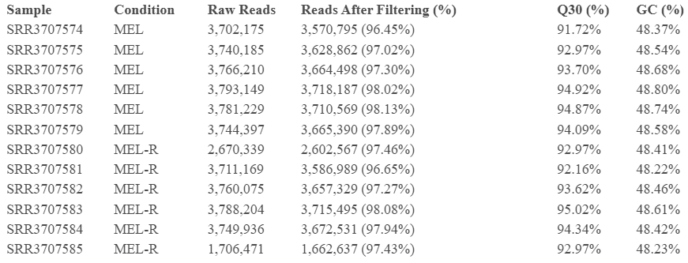

```{r setup, include=FALSE}
knitr::opts_chunk$set(echo = TRUE)
```

## 1. Introduction

The project report revisits and builds upon a differential expression (DE) analysis by RNA-seq to compare a murine erythroleukemia cell line (MEL) to a differentiation resistant derived cell line (MEL-R) [Fernández-Calleja et al., 2017]. The original experiment performed RNA isolation on the two cultured cell lines, prepared standard RNA-seq libraries, and sequenced them using the Illumina GAIIx platform as single-end reads. These reads were deposited in the Gene Expression Omnibus (GEO) database (<http://www.ncbi.nlm.nih.gov/geo/query/acc.cgi?acc=GSE83567>) and are utilized in this re-analysis. In the original workflow, the reads went through quality control (FASTX-Toolkit), were pre-processed to remove adapters, and mapped (TopHat) to a 2012 mouse reference genome (mm9, 30-04-2012). Finally, Cufflinks was used to perform a transcriptome expression quantification, and Cuffdiff was used for differential expression analysis. (The pipeline code for the original paper was not included).

Since the original experiment was performed in 2017, both the tools used in their pipeline and reference genome are now outdated. Accurate and splice-aware aligners (such as HISAT2) have superseded TopHat, while Cufflinks/Cuffdiffs has been replaced by improved, more robust, and faster approaches, like Salmon. Furthermore, the mouse reference genome has updated to GRCm39, which could affect gene-level results. This project aims to re-analyze the RNA-Seq data with these modern methods of analysis.

The report aims to build the results of Fernández-Calleja et al., 2017 with tools that are more detailed, accurate, and utilize more robust statistical methods. The reference genome used will also be a more recent version, which may provide better downstream results. By comparing the results from the original workflow to the updated pipeline, this report aims to evaluate the impact of advancements in genome bioinformatics on data interpretation.

## 2. Method and Results

The raw FASTQ files for all 12 samples (6 MEL, 6 MELR) were taken from the GEO (GSE83567). Two parallel quantification methods were used for this re-analysis. HISAT2+FeatureCounts were used for an alignment-based approach, and Salmon was used for an alignment-free alternative. Both pipelines underwent pre-processing using fastp. The updated reference genome (GRCm39) with GENCODE vM38 annotations replaced the outdated reference used in the paper. (DEPENDING ON DATA, 1-2 SENTENCES ON HOW USING 2 DIFFERENT METHODS WAS USEFUL) most likely: both methods showed different results. Flag certain genes as sensitive to how reads are counted. Could be: -genes with many multi-mapped reads (Salmon handles probabilistically, featureCounts discards or assigns differently) -genes with complex overlapping isoforms -genes effective length corrections matter. Careful drawing biological conclusions from them.

(FEW OVERVIEW SENTENCES FOR R ANALYSIS)

Analysis is appropriate, well motivated, described, interpreted, and correct Steps are properly validated

### a. Pipeline Creation

**Pre-Processing:** Fastp (v1.3.0) was used to trim the fastq samples and created QC reports for the trimmed samples under default shell parameters. The results of these reports are analyzed in [Part b](#part-b).

**Alignment-Based:** hisat2-build was used to build a genome index from the reference FASTA. Each sample's reads were then aligned to the GRCm39 primary assembly genome using hisat2. The outputted SAM files were converted to sorted BAM files (and indexed BAM.BAI files) through samtools functions. Gene-level read counts were retrieved from the sorted BAM files using featureCounts with the new GENCODE vM38 GTF annotation. Reads overlapping exon features were counted. The library was treated as unstranded (-s 0), described as such in the original study. This produced a gene-by-sample count matrix for further analysis in R.

**Alignment-Free:** Since the data provided in the original study is transcriptomic, Salmon should theoretically be able to quantify reads with a transcriptome-only index. However, to account for introduction of genomic reads (i.e. unspliced pre-mRNA or DNA contamination) in the library, a decoy-aware Salmon index was made. First, a decoy text file of the chromosomes that shouldn't be quantified was created (using the reference genome). Next, the reference transcriptome was concatenated with the reference transcriptome to create a "gentrome" for Salmon to align to, and avoid genomic reads.

The samples were quantified through salmon quant, with alignment validation to verify the quasi-mapping and filter out any low-scoring matches (with --validateMappings). The library was autodetected, using -l A. Though, post-trimming GC content was quite consistent throughout all samples, GC-bias was enabled. This may not have been necessary, but the fastp and salmon was run altogether in one pipeline, and there is no harm in including --gcBias. The fragment length distribution was manually assigned (as --fldMean 350 --fldSD 15), based on the library fragment sizes by specified as 337-367 nt in Fernández-Calleja et al., 2017. Salmon's estimated read counts (NumReads) and transcripts per million (TPM) were extracted from each sample's quant.sf for further analysis in R.

Refer to [Appendix B](#appendix-B) for the full pipeline code.

### b. Trimmed Reads Quality Control {#part-b}

As seen in Table 1, all 12 samples kept a high proportion of reads, with pass rates between 96.5% to 98.1%. There seemed to be no contamination or bias between the MEL/MEL-R samples. GC content was consistent across all 12 samples, ranging from 48.2% to 48.8%. This uniformity suggests the absence of contamination or systematic library preparation bias between samples. The sequencing depth did vary across samples. The six MEL replicates had \~3.70–3.79M raw reads each. But, two MEL-R samples had lower depth: SRR3707580 (2.67M reads) and SRR3707585 (1.71M reads). This could limit statistical power for detecting lower expressed differentially expressed genes.



Read length was 75 bp across all samples, consistent with the single-end sequencing protocol reported by Fernández-Calleja et al. (2017). Base quality was high across all samples. Q20 rates ranged from 96.9% to 98.4% and Q30 rates from 91.7% to 95.0%. The results show that fastp had a minor (but still beneficial) effect on removing low-quality bases and adapter sequences. Duplication rates were reported by fastp at 21–29%, though true duplicates can’t be distinguished from independent fragments that share identical short sequences. Thus, these estimates are probably unreliable for the single-end data.

### c. R Quality Control

Quality control measures are appropriate to the data analyzed, described well, and properly motivated \### d. DESeq2

### e. PCA

### f. ClusterProfiler

## Conclusion

Well thought out summary of results, appropriate contrasts with original publication. \## References Fernández-Calleja, V., Hernández, P., Schvartzman, J. B., Lacoba, M. G. de, & Krimer, D. B. (2017). Differential gene expression analysis by RNA-seq reveals the importance of actin cytoskeletal proteins in erythroleukemia cells. PeerJ, 5, e3432. <https://doi.org/10.7717/peerj.3432>

Claude was used to make pipeline code: <https://claude.ai/share/4a01406c-0372-4794-a1f5-cd3a6b785e2c>

## Appendix A: Plots/Code (?)

You can also embed plots, for example:

```{r pressure, echo=FALSE}
plot(pressure)
```

## Appendix B: Pipeline Code {#appendix-B}

```{bash, eval=FALSE}
#Includes 12 samples (6 MEL, 6 MELR. All single-end reads)
SAMPLES = ["SRR3707574","SRR3707575","SRR3707576","SRR3707577","SRR3707578","SRR3707579","SRR3707580","SRR3707581","SRR3707582","SRR3707583","SRR3707584","SRR3707585"]

rule all:
    input:
        expand("Results/QC/{sample}_fastqc.html", sample=SAMPLES)

rule fastqc:
    input:
        "Data/{sample}.fastq.gz"
    output:
        "Results/QC/{sample}_fastqc.html",
        "Results/QC/{sample}_fastqc.zip"
    shell:
        "fastqc {input} --outdir Results/QC/"
```

```{bash, eval=FALSE}
SAMPLES = ["SRR3707574","SRR3707575","SRR3707576","SRR3707577","SRR3707578","SRR3707579","SRR3707580","SRR3707581","SRR3707582","SRR3707583","SRR3707584","SRR3707585"]
#Reference files from updated mouse genome
GENOME = "../Refs/m38/GRCm39.primary_assembly.genome.fa"
TRANSCRIPTS = "../Refs/m38/gencode.vM38.transcripts.fa.gz"
GTF = "../Refs/m38/gencode.vM38.primary_assembly.annotation.gtf.gz"
rule all:
    input:
        "../Results/featureCounts/counts.txt",
        expand("../Results/salmon/{sample}/quant.sf", sample=SAMPLES)
#Trim adapters and low-quality reads (with QC reports for trimmed samples)
rule fastp:
    input:
        "../Data/{sample}.fastq.gz"
    output:
        "../Results/trimmed/{sample}.fastq.gz"
    shell:
        """
        mkdir -p ../Results/trimmed 
        fastp -i {input} -o {output} -h ../Results/trimmed/{wildcards.sample}_fastp.html -j ../Results/trimmed/{wildcards.sample}_fastp.json
        """
#HISAT2 Steps
#Step 1: Build HISAT2 genome index for alignment
rule hisat2_index:
    input:
        fasta=GENOME
    output:
        "../Refs/Indices/hisat2/idx.done"
    params:
        prefix="../Refs/Indices/hisat2/mouse_mm39"
    shell:
        """
        mkdir -p ../Refs/Indices/hisat2
        hisat2-build  {input.fasta}  {params.prefix}
        touch {output}
        """
#Step 2: Align trimmed samples
rule hisat2_align:
    input:
        reads="../Results/trimmed/{sample}.fastq.gz",
        idx="../Refs/Indices/hisat2/idx.done"
    output:
        "../Results/hisat2/{sample}.sam"
    params:
        index_prefix="../Refs/Indices/hisat2/mouse_mm39"
    shell:
        """
        mkdir -p ../Results/hisat2
        hisat2 -x {params.index_prefix} -U {input.reads} -S {output}
        """
#Step 3: SAM to BAM
rule samtools_sort:
    input:
        "../Results/hisat2/{sample}.sam"
    output:
        "../Results/hisat2/{sample}.bam"
    shell:
        """
        samtools view -bS {input} | samtools sort -o {output}
        """
#Step 4: BAM to BAM.BAI
rule samtools_index:
    input:
        "../Results/hisat2/{sample}.bam"
    output:
        "../Results/hisat2/{sample}.bam.bai"
    shell:
        """
        samtools index {input}
        """
#Step 5: Count matrix for all samples for DESeq in R
rule featurecounts:
    input:
        bams=expand("../Results/hisat2/{sample}.bam", sample=SAMPLES),
        gtf=GTF
    output:
        "../Results/featureCounts/counts.txt"
    shell:
        """
        mkdir -p ../Results/featureCounts
        featureCounts -a {input.gtf} -o {output} -t exon -g gene_id -s 0 {input.bams}
        """
#Salmon Steps
#Step 1: Chromosome names for decoys. Let Salmon know which sequences are genomic
rule create_decoys:
    input:
        genome=GENOME
    output:
        "../Refs/m38/decoys.txt"
    shell:
        """
        zgrep '^>' {input.genome} | cut -d ' ' -f 1 | sed 's/>//g' > {output}
        """
#Step 2: Cat genome and transcriptome into gentrome. Maps against transcripts (but genome used as decoy)
rule create_gentrome:
    input:
        tra=TRANSCRIPTS,
        gen=GENOME
    output:
        "../Refs/m38/gentrome.fa.gz"
    shell:
        """
        (zcat {input.tra}; cat {input.gen}) | gzip > {output}
        """
#Step 3: Salmon index from gentrome + decoy list
rule salmon_index:
    input:
        gent="../Refs/m38/gentrome.fa.gz",
        dec="../Refs/m38/decoys.txt"
    output:
        directory("../Refs/Indices/salmon_index")
    shell:
        """
        salmon index -t {input.gent} -d {input.dec} -i {output}
        """
#Step 4: Quasi-mapping to quantify each sample
#Average length of libraries noted to be 337–367 nt
rule salmon_quant:
    input:
        reads="../Results/trimmed/{sample}.fastq.gz",
        index="../Refs/Indices/salmon_index"
    output:
        "../Results/salmon/{sample}/quant.sf"
    shell:
        """
        mkdir -p ../Results/salmon/{wildcards.sample}
        salmon quant -i {input.index} -l A -r {input.reads} --validateMappings --gcBias --fldMean 350 --fldSD 15 -o ../Results/salmon/{wildcards.sample}
        """
```
