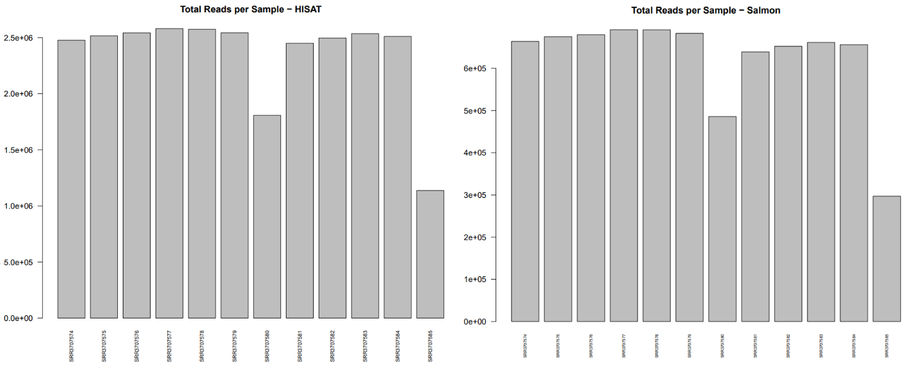
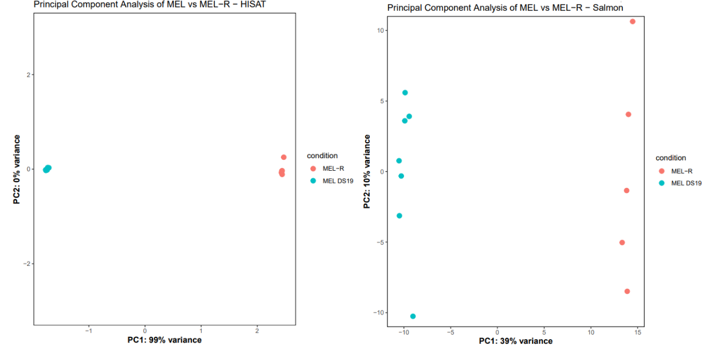
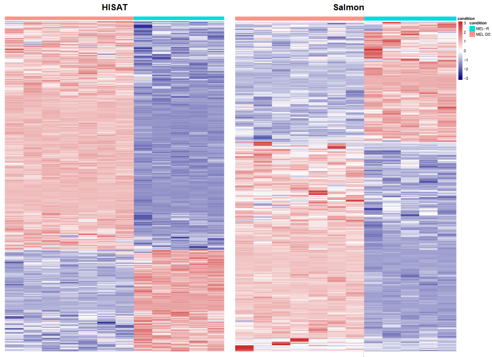
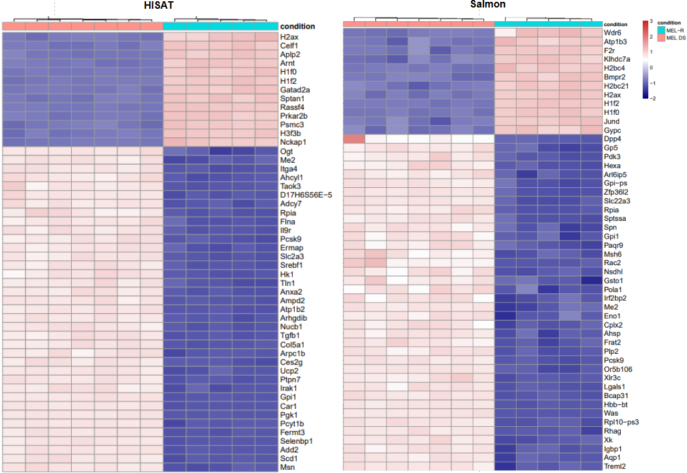
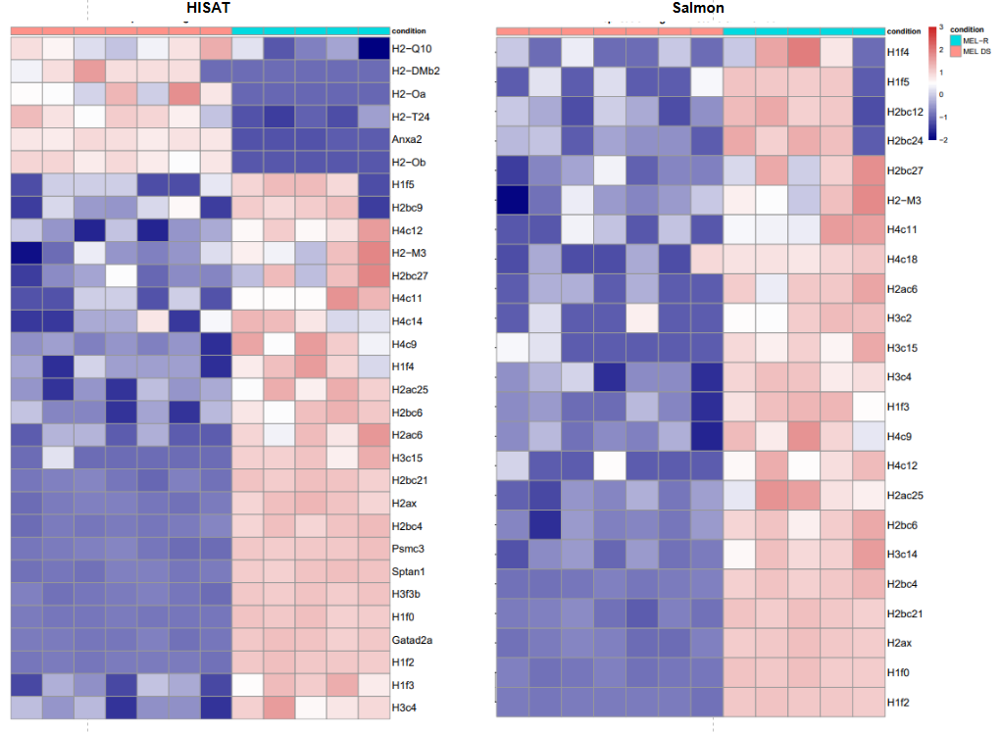
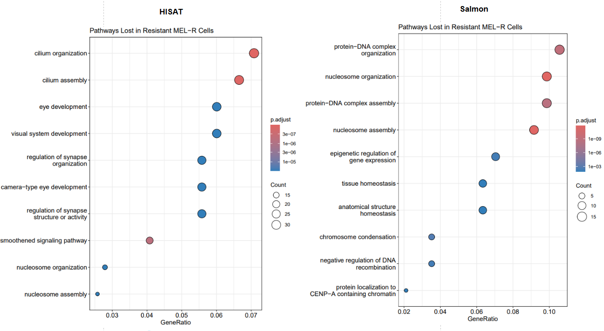
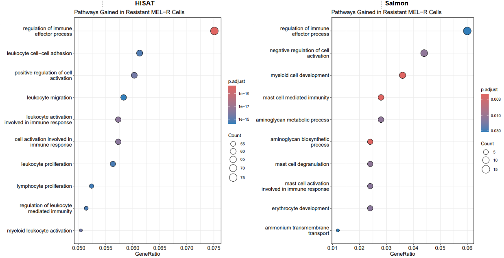
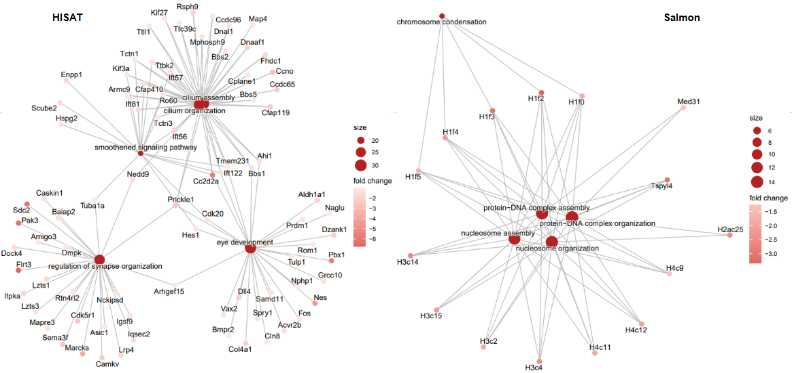
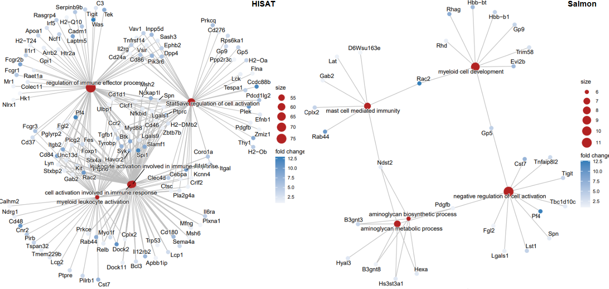

```{r setup, include=FALSE}
knitr::opts_chunk$set(echo = TRUE, fig.pos = 'H')
library(knitr)
library(tximport)
library(readr)
library(DESeq2)
library(apeglm)
library(DESeq2)
library(ggplot2)
library(pheatmap)
library(dplyr)
library(apeglm)
library(clusterProfiler)
library(org.Mm.eg.db)
```

## 1. Introduction

The project report revisits and builds upon a differential expression (DE) analysis by RNA-seq to compare a murine erythroleukemia cell line (MEL) to a differentiation resistant derived cell line (MEL-R) [Fernández-Calleja et al., 2017]. The original experiment performed RNA isolation on the two cultured cell lines, prepared standard RNA-seq libraries, and sequenced them using the Illumina GAIIx platform as single-end reads. These reads were deposited in the Gene Expression Omnibus (GEO) database (<http://www.ncbi.nlm.nih.gov/geo/query/acc.cgi?acc=GSE83567>) and are utilized in this re-analysis. In the original workflow, the reads went through quality control (FASTX-Toolkit), were pre-processed to remove adapters, and mapped (TopHat) to a 2012 mouse reference genome (mm9, 30-04-2012). Finally, Cufflinks was used to perform a transcriptome expression quantification, and Cuffdiff was used for differential expression analysis. (The pipeline code for the original paper was not included).

Since the original experiment was performed in 2017, both the tools used in their pipeline and reference genome are now outdated. Accurate and splice-aware aligners (such as HISAT2) have superseded TopHat, while Cufflinks/Cuffdiffs has been replaced by improved, more robust, and faster approaches, like Salmon. Furthermore, the mouse reference genome has updated to GRCm39, which could affect gene-level results. This project aims to re-analyze the RNA-Seq data with these modern methods of analysis.

The report aims to build the results of Fernández-Calleja et al., 2017 with tools that are more detailed, accurate, and utilize more robust statistical methods. The reference genome used will also be a more recent version, which may provide better downstream results. By comparing the results from the original workflow to the updated pipeline, this report aims to evaluate the impact of advancements in genome bioinformatics on data interpretation.

## 2. Method and Results

The raw FASTQ files for all 12 samples (6 MEL, 6 MELR) were taken from the GEO (GSE83567). Two parallel quantification methods were used for this re-analysis. The updated reference genome (GRCm39) with GENCODE vM38 annotations replaced the outdated reference used in the paper. HISAT2 (with FeatureCounts) was used for an alignment-based approach, and Salmon was used for an alignment-free alternative. In R, Differential Expression and Pathway analyses were performed to compare the results of the modernized pipeline to those of Fernández-Calleja et al., 2017. The R analysis of Salmon is included in [Appendix B](#appendix-B) and of HISAT2 is in [Appendix C](#appendix-C).

### a. Pipeline Creation

**Pre-Processing:** Fastp (v1.3.0) was used to trim the fastq samples and created QC reports for the trimmed samples under default shell parameters. The results of these reports are analyzed in [Part b](#part-b).

**Alignment-Based:** hisat2-build was used to build a genome index from the reference FASTA. Each sample's reads were then aligned to the GRCm39 primary assembly genome using hisat2. The outputted SAM files were converted to sorted BAM files (and indexed BAM.BAI files) through samtools functions. Gene-level read counts were retrieved from the sorted BAM files using featureCounts with the new GENCODE vM38 GTF annotation. Reads overlapping exon features were counted. The library was treated as unstranded (-s 0), described as such in the original study. This produced a gene-by-sample count matrix for further analysis in R.

**Alignment-Free:** Since the data provided in the original study is transcriptomic, Salmon should theoretically be able to quantify reads with a transcriptome-only index. However, to account for introduction of genomic reads (i.e. unspliced pre-mRNA or DNA contamination) in the library, a decoy-aware Salmon index was made. First, a decoy text file of the chromosomes that shouldn't be quantified was created (using the reference genome). Next, the reference transcriptome was concatenated with the reference genome to create a "gentrome" for Salmon to align to, and avoid genomic reads.

The samples were quantified through salmon quant, with alignment validation to verify the quasi-mapping and filter out any low-scoring matches (with --validateMappings). The library was autodetected, using -l A. Though, post-trimming GC content was quite consistent throughout all samples, GC-bias was enabled. This may not have been necessary, but the fastp and salmon was run altogether in one pipeline, and there is no harm in including --gcBias. The fragment length distribution was manually assigned (as --fldMean 350 --fldSD 15), based on the library fragment sizes by specified as 337-367 nt in Fernández-Calleja et al., 2017. Salmon's estimated read counts (NumReads) and transcripts per million (TPM) were extracted from each sample's quant.sf for further analysis in R.

Refer to [Appendix A](#appendix-A) for the full pipeline code.

### b. Trimmed Reads Quality Control {#part-b}

As seen in Table 1, all 12 samples kept a high proportion of reads, with pass rates between 96.5% to 98.1%. There seemed to be no contamination or bias between the MEL/MEL-R samples. GC content was consistent across all 12 samples, ranging from 48.2% to 48.8%. This uniformity suggests the absence of contamination or systematic library preparation bias between samples. The sequencing depth did vary across samples. The six MEL replicates had \~3.70--3.79M raw reads each. But, two MEL-R samples had lower depth: SRR3707580 (2.67M reads) and SRR3707585 (1.71M reads). This could limit statistical power for detecting lower expressed differentially expressed genes.


Read length was 75 bp across all samples, consistent with the single-end sequencing protocol reported by Fernández-Calleja et al., 2017. Base quality was high across all samples. Q20 rates ranged from 96.9% to 98.4% and Q30 rates from 91.7% to 95.0%. The results show that fastp had a minor (but still beneficial) effect on removing low-quality bases and adapter sequences. Duplication rates were reported by fastp at 21--29%, though true duplicates can't be distinguished from independent fragments that share identical short sequences. Thus, these estimates are probably unreliable for the single-end data.

### c. R Quality Control

After executing the snakemake pipeline and fastQC, we compared the sample counts from the two methods: HISAT2 (alignment) and Salmon (quasi mapping) (see figure 2). As expected, the variance between samples for both methods is the same and corresponds to read depth from raw data. The lower read counts in the Salmon pipeline are likely attributable to its strict criteria for transcript-level quantification and pseudo-alignment, compared to HISAT2's genomic alignment.

```{r, echo=FALSE, fig.cap="Comparison of sequencing depth and mapping between HISAT2 and Salmon. Total read counts per sample are shown with HISAT2 (left) and Salmon (right). While sample to sample counts remain similar between the two methods, the total magnitude of reads is significantly lower using Salmon.", out.width="100%", fig.align="center"}


```

To ensure data integrity for downstream differential expression, we performed data cleaning by removing duplicate counts and stripping ENSEMBL version numbers from row labels. Low count genes (less than 10 counts across all replicates) were dropped to reduce noise.

Both pipelines demonstrated perfect separation between the MEL (sensitive) and MEL-R (resistant) clusters along the first principal component (PC1). This confirms that the transition to a resistant phenotype is the dominant driver of transcriptomic change, validating the initial pipeline results. Interestingly, in the HISAT2 pipeline PC1 covers 99% of the variance which is unusually high, compared to the Salmon method in which PC1 covers only 39%, with a stronger contribution from PC2. The overwhelming variance coverage by PC1 in the HISAT pipeline could mean that there is some oversimplification of the transcriptomic landscape, which leads to a more straightforward differentiation between the samples along one component. To investigate the extreme variance distribution observed in the HISAT2 pipeline (99% PC1), we analyzed the top gene loadings contributing to PC1. In the HISAT2 workflow, PC1 was dominated by genes such as Car1 and Pgk1. Conversely, the Salmon pipeline's PC1 was characterized by regulatory signaling genes, including Rassf4 and Rac2. The fact that Salmon attributes only 39% of variance to PC1, despite achieving the same perfect cluster separation as HISAT2, suggests that pseudo-alignment captures a more granular and multi-faceted regulatory landscape. This could indicate that while HISAT2 is highly effective for identifying large shifts in cellular state, Salmon provides a more sensitive method for uncovering the specific signaling pathways.

```{r, echo=FALSE, fig.cap="Principal Component Analysis (PCA) of MEL vs. MEL-R samples, comparing HISAT2 (left) and Salmon (right). For HISAT2 PC1 covers an overwhelming 99% of the variance, whereas for Salmon PC1 covers far less: 39%. The distinct separation of the treatment groups confirms strong reproducibility between replicates and strong biological signal.", fig.height=6, fig.width=10, out.width="100%", fig.align="center"}


```

### d. DESeq2

To perform differential expression analysis we used the DESeq2 package in R. Specifying the condition as part of the experimental design to ensure we are comparing the cell types based on treatment (resistant vs. sensitive). We applied Log-Fold-Change shrinkage (using apeglm library) to account for high noise or low-count genes, giving us more conservative and reliable results.

We further identified significant genes according to the method the reference paper used: filtering for an adjusted p value of at least 0.05 (to reduce false discovery rate) and a minimum 2 fold change in expression (Log2-FC \> 1). Finally ENSEMBL identifiers were mapped to official gene symbols using the org.Mm.eg.db database (of which only successfully mapped genes were kept).

### e. Expression Analysis

#### i. Global Differential Expression (Fig 1A - Fernández-Calleja et al., 2017)

To assess the global transcriptomic shift between the sensitive and resistant phenotypes, we generated heatmaps encompassing the full range of significantly differentially expressed genes for both the HISAT2 and Salmon pipelines (Figure 4). In both workflows it is clear that the replicates were clustered together perfectly, indicating a fundamental shift in gene expression when cells become resistant.

```{r, echo=FALSE, fig.cap="Shows total gene heatmap, ordered by significance (p adjusted value). Importantly, the treatment groups (MEL and MEL-R) are clustered together in both cases and show similar expression patterns. However, the ordering of significance is clearly different between the methods.", fig.height=6, fig.width=10, out.width="80%", fig.align="center"}


```

While the macro-level patterns of expression are consistent across both methods, the gene ordering and visual "texturing" of the heatmaps are different. Notably, the Salmon heatmap exhibits more prominent "white" regions (representing genes with expression levels near the mean). This increased granularity is likely a result of Salmon's conservative quasi-mapping and transcript-level resolution. The separation of the heatmaps into distinct upregulated (red) and downregulated (blue) blocks provides clear evidence of a robust biological signal, validating the effectiveness of the induction protocol and our downstream normalization.

#### ii. Top 50 Significant Gene Differential Expression (Fig 1B - Fernández-Calleja et al., 2017)

To analyze the most impactful drivers of resistance, we narrowed our focus to the top 50 differentially expressed genes (DEGs) ranked by statistical significance. This replication of the reference study's Figure 1B highlights the specific gene candidates that define each pipeline's output.

In Figure 1 of the reference paper, the authors emphasize that the transition to resistance is defined by a "cytoskeletal collapse," specifically the silencing of the actin regulatory network. Our **Top 50 Significant Gene** heatmaps (Figure 5) successfully capture this phenomenon: the Salmon results identify the significant downregulation of **Was** and **Rac2** which are two essential signaling controllers of actin polymerization, while **HISAT2** identifies the loss of **Sptan1** (alpha-spectrin), a critical physical scaffold for erythroid membrane stability. Although it is important to note that our analysis found many genes that were not previously reported by the authors, which could be attributed to the newer "alignment" methods and newer genome used in this replication.

```{r, echo=FALSE, fig.cap="Expression profiles of top 50 differentially expressed genes, ranked by adjusted p value after filtering for Log Fold Change > 1. Expression Values are Z-score normalized to highlight relative difference between MEL and MEL-R (Resistant) samples.", fig.height=6, fig.width=10, out.width="80%", fig.align="center"}


```

#### iii. Histone Specific Gene Differential Expression (Fig 1C - Fernández-Calleja et al., 2017)

```{r, echo=FALSE, fig.cap="Fig 1C Replication from study. Expression profiles of top significant histone related genes.", fig.height=6, fig.width=10, out.width="80%", fig.align="center"}


```

Our Histone Specific heatmap (Figure 6) provides a strong replication of the paper's Figure 1C, showing a robust and uniform upregulation of histone family transcripts (such as **H2bc21** and **H2ax**) in the MEL-R replicates. To achieve this we searched the significant gene list for all candidate genes that matched the following regex: "\^H[0-9]\|hist", as well as the mentioned genes from the paper. Noticeably, the heatmaps differ on a substantial portion (top) where we see a large blue region for the HISAT2 pipeline. Also, curiously one sample for the Salmon pipeline exhibited down regulation where the other replicates for the MEL-R samples showed up regulation.

### f. Pathway Analysis

To understand the biological functions that are affected during the development of resistance, we performed GO enrichment analysis on genes with significantly decreased and increased expression levels for both methods (Figures 7 and 8). To further understand the network of affected pathways and the related genes we performed a Gene Network analysis with the cnetplot library (Figures 9 and 10).

```{r, echo=FALSE, fig.cap="Comparative Gene Ontology (GO) enrichment analysis of downregulated biological processes. The dot plots illustrate top enriched GO terms for genes downregulated in MEL-R cells compared to MEL cells. Showing the differences resulting from using the two methods (HISAT2 vs. Salmon).", fig.height=4, fig.width=8, out.width="100%", fig.align="center"}


```

The downregulated GO analysis illustrates a clear difference between Salmon and HISAT2. The Salmon results (Figure 7, Right) are dominated by terms related to chromatin and DNA organization, such as "nucleosome organization," "protein-DNA complex assembly," and "epigenetic regulation of gene expression." the HISAT2 results (Figure 7, Left) emphasize the loss of structural and developmental pathways, such as "cilium organization," "eye development," and "regulation of synapse organization." The resistant cells are losing the necessary pathways for erythroid maturation and instead gaining pathways that are typical for immune cells (Figure 8, Left). In the context of MEL cells, this reflects the "cytoskeletal collapse" described in the PeerJ study. "Nucleosome organization" and "nucleosome assembly" do appear in the bottom of the HISAT2 dotplot (Figure 7, Left), which indicates a slight overlap between the pipelines, but the rankings of the downregulated pathways differs greatly.

```{r, echo=FALSE, fig.cap="Comparative Gene Ontology (GO) enrichment analysis of  biological upregulated processes. The dot plots illustrate top enriched GO terms for genes upregulated in MEL-R cells compared to MEL cells. Showing the differences resulting from using the two methods (HISAT2 vs. Salmon).", fig.height=6, fig.width=10, out.width="100%", fig.align="center"}


```

```{r, echo=FALSE, fig.cap="Gene-concept network (cnetplot) of downregulated pathways. Network visualization showing connections between the significantly enriched GO terms and they associated differentially expressed genes, comparing HISAT (left) and Salmon (right) results. Network shows that Salmon pipeline results are driven by histone genes whereas the HISAT pipeline identifies clusters related to cellular structure and development.", out.width="110%", fig.align="center"}


```

As shown in the Downregulated cnetplot (Figure 9), this seems to be driven by a tightly interconnected cluster of histone-family genes (e.g., H1f2, H1f0, H2bc21). Therefore, the transcript-level resolution of the Salmon pipeline is more sensitive to downregulation of specific histone isoforms, compared to the HISAT2 alignment, which may mask them at the gene-level.

```{r, echo=FALSE, fig.cap="Gene-concept network (cnetplot) of upregulated pathways. Comparative analysis for HISAT (left) and Salmon (right) show significant difference. HISAT results reveal a highly dense and interconnected set of genes relating to leukocyte and myeloid cell activation.", out.width="110%", fig.align="center"}


```

## Conclusion

The re-analysis of the MEL and MEL-R datasets confirms the biological findings from Fernández-Calleja et al., 2017. Despite modernizing every component of the data processing pipeline, the core results stayed quite consistent. Actin cytoskeletal genes (Was, Btk, Rac2, Dock2, and Plek) are downregulated in differentiation-resistant MEL-R cells, while histone genes are upregulated. The key biological process in the original study (collapse of the actin cytokskeletal network and remodeling of the epigenetic structure) stayed consistent in the re-analysis.

The difference in pathways found between the two pipelines do suggest that pipeline construction must be customized to the dataset being used. Both HISAT2 and Salmon illustrated clear separation of MEL and MEL-R in PCA and had a few overlapping sets of differentially express genes. But, HISAT2 had a very concentrated variance (99%) in PC1, while the Salmon variance was distributed more evenly (39% in PC1). The 2 pipelines had different genes driving differentiation, with HISAT2 being dominated by Car1 and Pgk1 and Salmon having Rac2 and Rassf4 on the top. Salmon uses probabilistic mapping at the transcription level, which could residstribute the feature counts more evenly. On the other hand, HISAT2 determines counts each read to a gene's exon, which could cause certain genes to have a dominating variance.

A key limitation of this study was the reduced sequencing depth of two of the MEL-R samples (SRR3707580 and SRR3707585). This could have limited the detection of more subtle differential expression changes. Additionally, the original study derived the cell lines from the same parent cultures. There is a possibility that repeating this study with multiple parent cultures could show a more varied result.

## References

Fernández-Calleja, V., Hernández, P., Schvartzman, J. B., Lacoba, M. G. de, & Krimer, D. B. (2017). Differential gene expression analysis by RNA-seq reveals the importance of actin cytoskeletal proteins in erythroleukemia cells. PeerJ, 5, e3432. <https://doi.org/10.7717/peerj.3432>

Claude was used to make pipeline code: <https://claude.ai/share/4a01406c-0372-4794-a1f5-cd3a6b785e2c>

Google Gemini was used for R analysis: <https://gemini.google.com/share/602846987f74>, <https://gemini.google.com/share/ba893efa520c>

## Appendix A: Pipeline Code {#appendix-A}

```{bash, eval=FALSE}
#Includes 12 samples (6 MEL, 6 MELR. All single-end reads)
SAMPLES = ["SRR3707574","SRR3707575","SRR3707576","SRR3707577","SRR3707578","SRR3707579",
"SRR3707580","SRR3707581","SRR3707582","SRR3707583","SRR3707584","SRR3707585"]

rule all:
    input:
        expand("Results/QC/{sample}_fastqc.html", sample=SAMPLES)

rule fastqc:
    input:
        "Data/{sample}.fastq.gz"
    output:
        "Results/QC/{sample}_fastqc.html",
        "Results/QC/{sample}_fastqc.zip"
    shell:
        "fastqc {input} --outdir Results/QC/"
```

```{bash, eval=FALSE}
SAMPLES = ["SRR3707574","SRR3707575","SRR3707576","SRR3707577","SRR3707578","SRR3707579",
"SRR3707580","SRR3707581","SRR3707582","SRR3707583","SRR3707584","SRR3707585"]
#Reference files from updated mouse genome
GENOME = "../Refs/m38/GRCm39.primary_assembly.genome.fa"
TRANSCRIPTS = "../Refs/m38/gencode.vM38.transcripts.fa.gz"
GTF = "../Refs/m38/gencode.vM38.primary_assembly.annotation.gtf.gz"
rule all:
    input:
        "../Results/featureCounts/counts.txt",
        expand("../Results/salmon/{sample}/quant.sf", sample=SAMPLES)
#Trim adapters and low-quality reads (with QC reports for trimmed samples)
rule fastp:
    input:
        "../Data/{sample}.fastq.gz"
    output:
        "../Results/trimmed/{sample}.fastq.gz"
    shell:
        """
        mkdir -p ../Results/trimmed 
        fastp -i {input} -o {output} -h ../Results/trimmed/{wildcards.sample}_fastp.html -j ../Results/trimmed/{wildcards.sample}_fastp.json
        """
#HISAT2 Steps
#Step 1: Build HISAT2 genome index for alignment
rule hisat2_index:
    input:
        fasta=GENOME
    output:
        "../Refs/Indices/hisat2/idx.done"
    params:
        prefix="../Refs/Indices/hisat2/mouse_mm39"
    shell:
        """
        mkdir -p ../Refs/Indices/hisat2
        hisat2-build  {input.fasta}  {params.prefix}
        touch {output}
        """
#Step 2: Align trimmed samples
rule hisat2_align:
    input:
        reads="../Results/trimmed/{sample}.fastq.gz",
        idx="../Refs/Indices/hisat2/idx.done"
    output:
        "../Results/hisat2/{sample}.sam"
    params:
        index_prefix="../Refs/Indices/hisat2/mouse_mm39"
    shell:
        """
        mkdir -p ../Results/hisat2
        hisat2 -x {params.index_prefix} -U {input.reads} -S {output}
        """
#Step 3: SAM to BAM
rule samtools_sort:
    input:
        "../Results/hisat2/{sample}.sam"
    output:
        "../Results/hisat2/{sample}.bam"
    shell:
        """
        samtools view -bS {input} | samtools sort -o {output}
        """
#Step 4: BAM to BAM.BAI
rule samtools_index:
    input:
        "../Results/hisat2/{sample}.bam"
    output:
        "../Results/hisat2/{sample}.bam.bai"
    shell:
        """
        samtools index {input}
        """
#Step 5: Count matrix for all samples for DESeq in R
rule featurecounts:
    input:
        bams=expand("../Results/hisat2/{sample}.bam", sample=SAMPLES),
        gtf=GTF
    output:
        "../Results/featureCounts/counts.txt"
    shell:
        """
        mkdir -p ../Results/featureCounts
        featureCounts -a {input.gtf} -o {output} -t exon -g gene_id -s 0 {input.bams}
        """
#Salmon Steps
#Step 1: Chromosome names for decoys. Let Salmon know which sequences are genomic
rule create_decoys:
    input:
        genome=GENOME
    output:
        "../Refs/m38/decoys.txt"
    shell:
        """
        zgrep '^>' {input.genome} | cut -d ' ' -f 1 | sed 's/>//g' > {output}
        """
#Step 2: Cat genome and transcriptome into gentrome. Maps against transcripts (but genome used as decoy)
rule create_gentrome:
    input:
        tra=TRANSCRIPTS,
        gen=GENOME
    output:
        "../Refs/m38/gentrome.fa.gz"
    shell:
        """
        (zcat {input.tra}; cat {input.gen}) | gzip > {output}
        """
#Step 3: Salmon index from gentrome + decoy list
rule salmon_index:
    input:
        gent="../Refs/m38/gentrome.fa.gz",
        dec="../Refs/m38/decoys.txt"
    output:
        directory("../Refs/Indices/salmon_index")
    shell:
        """
        salmon index -t {input.gent} -d {input.dec} -i {output}
        """
#Step 4: Quasi-mapping to quantify each sample
#Average length of libraries noted to be 337–367 nt
rule salmon_quant:
    input:
        reads="../Results/trimmed/{sample}.fastq.gz",
        index="../Refs/Indices/salmon_index"
    output:
        "../Results/salmon/{sample}/quant.sf"
    shell:
        """
        mkdir -p ../Results/salmon/{wildcards.sample}
        salmon quant -i {input.index} -l A -r {input.reads} --validateMappings --gcBias --fldMean 350 --fldSD 15 -o ../Results/salmon/{wildcards.sample}
        """
```

## Appendix B: Salmon Analysis {#appendix-B}

```{r, eval=FALSE}
#load the Metadata table
table <- read.csv("SraRunTable.csv")
metadata <- data.frame(row.names = table$Run, condition = factor(table$cell_line))
sample_ids <- c("SRR3707574", "SRR3707575", "SRR3707576", "SRR3707577", "SRR3707578", "SRR3707579", "SRR3707580", "SRR3707581", "SRR3707582", "SRR3707583", "SRR3707584", "SRR3707585")

files <- file.path("salmon_quant", paste0(sample_ids, "_quant.sf"))
print(file.exists(files))
# Read the first Salmon file for debugging
test_quant <- read.table(files[1], header = TRUE, sep = "\t")
# How many genes are present
print(paste("Total rows in Salmon file:", nrow(test_quant)))
head(test_quant$Name)

clean_salmon <- function(file) {
  # Read the original file
  raw <- read.table(file, header = TRUE, sep = "\t")
    # Use regex
  raw$Name <- gsub("\\..*|\\|.*", "", raw$Name)
    return(raw)}
tx2gene <- AnnotationDbi::select(org.Mm.eg.db, keys = keys(org.Mm.eg.db), columns = c("ENSEMBLTRANS", "SYMBOL"))
tx2gene <- tx2gene[!is.na(tx2gene$ENSEMBLTRANS), c("ENSEMBLTRANS", "SYMBOL")]
nrow(tx2gene)
txi <- tximport(files, type = "salmon", tx2gene = tx2gene, ignoreTxVersion = TRUE, countsFromAbundance = "lengthScaledTPM")

# Check the row count now
print(paste("Rows in txi counts:", nrow(txi$counts)))
summary(rowSums(txi$counts))

dds_salmon <- DESeqDataSetFromTximport(txi, 
                                       colData = metadata, 
                                       design = ~condition)
keep <- rowSums(counts(dds_salmon)) >= 10
dds_salmon <- dds_salmon[keep, ]

# Check the final row count
print(paste("Final rows for Analysis:", nrow(dds_salmon)))

# Run DESeq2 and check summary
dds_salmon <- DESeq(dds_salmon)
res_salmon <- results(dds_salmon, alpha = 0.05)
summary(res_salmon)
vsd <- vst(dds_salmon, blind=FALSE)

# Capture the PCA data first so we can manipulate it
pcaData <- plotPCA(vsd, intgroup="condition", returnData=TRUE)
percentVar <- round(100 * attr(pcaData, "percentVar"))

ggplot(pcaData, aes(PC1, PC2, color=condition)) + geom_point(size=3) + xlab(paste0("PC1: ", percentVar[1], "% variance")) + ylab(paste0("PC2: ", percentVar[2], "% variance")) + coord_cartesian(ylim = c(-3, 3)) + theme_bw() + theme(panel.grid.major = element_blank(), panel.grid.minor = element_blank(), axis.title = element_text(size=12, face="bold")) + ggtitle("Principal Component Analysis of MEL vs MEL-R")
colSums(counts(dds_salmon))

# Plot to see if any sample is dramatically smaller/larger
barplot(colSums(counts(dds_salmon)), 
        main="Total Reads per Sample", 
        ylab="Library Size", 
        las=2, 
        cex.names=0.5)

# Apply the shrinkage
resLFC <- lfcShrink(dds_salmon, coef=2, type="apeglm")
# Filter using (p-adj < 0.05 and |LFC| > 1)
sig_genes <- subset(resLFC, padj < 0.05 & abs(log2FoldChange) > 1)
print(paste("Final Significant Gene Count:", nrow(sig_genes)))
sig_genes$symbol <- rownames(sig_genes)
mapped_genes <- nrow(sig_genes)
print(paste("Total Symbols available:", mapped_genes))
head(sig_genes)

vsd <- vst(dds_salmon, blind=FALSE)
# Sort by significance for better visualization
all_sig_ordered <- sig_genes[order(sig_genes$padj), ]
global_matrix <- assay(vsd)[rownames(all_sig_ordered), ]
# Fig 1A
pheatmap(global_matrix, cluster_rows = TRUE, cluster_cols = TRUE, show_rownames = FALSE, scale = "row", annotation_col = as.data.frame(colData(dds_salmon)[,"condition", drop=FALSE]), color = colorRampPalette(c("navy", "white", "firebrick3"))(100), main = "Replication Fig 1A: Global Signature (|LFC|>1)")

# Figure 1B - Using top 50 significant genes
vsd <- vst(dds_salmon, blind=FALSE)
all_sig_ordered <- sig_genes[order(sig_genes$padj), ]
top50_sig <- head(all_sig_ordered, 50)
plot_matrix <- assay(vsd)[rownames(top50_sig), ]
rownames(plot_matrix) <- top50_sig$symbol
plot_matrix_scaled <- t(scale(t(plot_matrix)))

# Forces the scale from -2 to 3 - like the paper
my_breaks <- seq(-2, 3, length.out = 101)
my_colors <- colorRampPalette(c("navy", "white", "firebrick3"))(100)
pheatmap(plot_matrix_scaled, breaks = my_breaks, legend_breaks = c(-2, -1, 0, 1, 2, 3), cluster_rows = TRUE, cluster_cols = TRUE, show_rownames = TRUE, scale = "none", annotation_col = as.data.frame(colData(dds_salmon)[, "condition", drop=FALSE]), color = my_colors, main = "Salmon - Replication Fig 1B: Adjusted Range (-2 to 3)")

#Figure 1B - Direct Replica using their gene names
paper_list <- c(
  "Spi1",      
  "Was", "Btk", "Rac2", "Dock2", "Plek", 
  "Nckap1l", "Fgd3", "Arhgef10l", "Thy1", "Itgb2", 
  "Coro1a", "Evl", "Lcp2", "Vav1", "Hcls1", "Cd48",
  "Bin2", "Inpp5d", "Ptprc", "Cyba", "Ncf1", "Ncf2", "Ncf4"
)
paper_subset <- sig_genes[sig_genes$symbol %in% paper_list, ]
plot_matrix <- assay(vsd)[rownames(paper_subset), ]
rownames(plot_matrix) <- paper_subset$symbol
plot_matrix_scaled <- t(scale(t(plot_matrix)))
my_breaks <- seq(-2, 3, length.out = 101)
my_colors <- colorRampPalette(c("navy", "white", "firebrick3"))(100)
pheatmap(plot_matrix_scaled, breaks = my_breaks, legend_breaks = c(-2, -1, 0, 1, 2, 3), cluster_rows = TRUE, cluster_cols = FALSE, show_rownames = TRUE, fontsize_row = 10, scale = "none", annotation_col = as.data.frame(colData(dds_salmon)[, "condition", drop=FALSE]), color = my_colors, main = "Replication Fig 1B: Targeted Paper Gene Set (-2 to 3)")

# Figure 1C - Histone
histone_list <- c(
  "H2ax", "H1f0", "H1f2", "H3f3b", "H2afz",
  "Hmgb1", "Hmgb2",
  "Sptan1", "Gatad2a", "Psmc3",
  "Anxa2", "Top2a", "Dppa5a"
  )

histone_subset <- sig_genes[sig_genes$symbol %in% histone_list, ]
mat_1c <- assay(vsd)[rownames(histone_subset), ]
rownames(mat_1c) <- histone_subset$symbol

mat_1c_scaled <- t(scale(t(mat_1c)))
pheatmap(mat_1c_scaled, breaks = my_breaks,
         legend_breaks = c(-2, -1, 0, 1, 2, 3), cluster_rows = TRUE, cluster_cols = FALSE,
         show_rownames = TRUE, fontsize_row = 11, scale = "none", annotation_col = as.data.frame(colData(dds_salmon)[, "condition", drop=FALSE]), color = my_colors, main = "Replication Fig 1C: Histone & Chromatin Signature")

# Cluster Profiler
genes_down <- sig_genes[sig_genes$log2FoldChange < 0, "symbol"]
genes_up <- sig_genes[sig_genes$log2FoldChange > 0, "symbol"]
ego_down <- enrichGO(gene = genes_down, OrgDb = org.Mm.eg.db, keyType = 'SYMBOL', ont = "BP", 
pAdjustMethod = "BH", pvalueCutoff  = 0.05)

dotplot(ego_down, showCategory=10)

genelist_vector <- sig_genes$log2FoldChange
names(genelist_vector) <- sig_genes$symbol
cnetplot(ego_down, foldChange = genelist_vector, 
         layout = "kk",
         showCategory = 5, 
         color_category = "firebrick")
```

## Appendix C: HISAT Alignment Analysis {#appendix-C}

```{r, eval=FALSE}
#load the Metadata table
table <- read.csv("SraRunTable.csv")
metadata <- data.frame(row.names = table$Run, condition = factor(table$cell_line))
#load raw count data
count_data <- read.table("featureCounts/counts.txt", header=TRUE, row.names=1, check.names=FALSE)
# separate for look up and DESeq2 workflow
gene_annotations <- count_data[, 1:5]
counts <- count_data[, 6:ncol(count_data)]
colnames(counts) <- gsub(".*(SRR[0-9]+).*", "\\1", colnames(counts))
# strip row labels of version number (decimals)
rownames(counts) <- gsub("\\..*", "", rownames(counts))
# check if this introduces dups
any(duplicated(rownames(counts)))
# Create the DESeqDataSet
dds_hisat <- DESeqDataSetFromMatrix(countData = counts, colData = metadata, design = ~ condition)
# Pre Filtering
# Drop low count genes across all samples
global_counts <- rowSums(counts(dds_hisat))
keep_global <- global_counts >= 10
dds_hisat <- dds_hisat[keep_global,]
# Remaining genes
nrow(dds_hisat)

# QC, check if the difference in the groups is happening due to the treatment
# Use VST normalization to make variance somewhat constant (accounting for low expression genes)
vsd <- vst(dds_hisat, blind=FALSE)

# extract top contributors to PC1
rv <- rowVars(assay(vsd))
select <- order(rv, decreasing = TRUE)[seq_len(min(500, length(rv)))]
pca_res <- prcomp(t(assay(vsd)[select, ]))

# Get the loadings (rotation)
loadings <- as.data.frame(pca_res$rotation)
top_10_pc1_genes <- loadings[order(abs(loadings$PC1), decreasing = TRUE), ][1:10, ]
print("Top 10 Genes contributing to PC1:")
gene_symbols <- mapIds(org.Mm.eg.db, keys = rownames(top_10_pc1_genes), column = "SYMBOL", keytype = "ENSEMBL", multiVals = "first")
print(gene_symbols)

pcaData <- plotPCA(vsd, intgroup="condition", returnData=TRUE)
percentVar <- round(100 * attr(pcaData, "percentVar"))

ggplot(pcaData, aes(PC1, PC2, color=condition)) + geom_point(size=3) + xlab(paste0("PC1: ", percentVar[1], "% variance")) + ylab(paste0("PC2: ", percentVar[2], "% variance")) + coord_cartesian(ylim = c(-3, 3)) + theme_bw() + theme(panel.grid.major = element_blank(), panel.grid.minor = element_blank(), axis.title = element_text(size=12, face="bold"))

# Sum the counts for each column (sample)
colSums(counts(dds_hisat))

# Plot it to see if any sample is dramatically smaller/larger
barplot(colSums(counts(dds_hisat)), main="Total Reads per Sample", ylab="Library Size", las=2, cex.names=0.5)

# Run DESeq2
dds_complete <- DESeq(dds_hisat)
resultsNames(dds_complete)
levels(dds_complete$condition)

# Apply the shrinkage (using the existing coefficient)
resLFC <- lfcShrink(dds_complete, coef=2, type="apeglm")
# Filter using (p-adj < 0.05 and |LFC| > 1)
sig_genes <- subset(resLFC, padj < 0.05 & abs(log2FoldChange) > 1)
print(paste("Final Significant Gene Count:", nrow(sig_genes)))

gene_symbols <- mapIds(org.Mm.eg.db, keys=rownames(sig_genes), column="SYMBOL", keytype="ENSEMBL", multiVals="first")

sig_genes$symbol <- gene_symbols
mapped_genes <- sum(!is.na(gene_symbols))
mapped_genes
sig_genes <- sig_genes[!is.na(sig_genes$symbol), ]

# Create Global Heatmap
vsd <- vst(dds_complete, blind=FALSE)
# Sort by significance for better visualization
all_sig_ordered <- sig_genes[order(sig_genes$padj), ]
global_matrix <- assay(vsd)[rownames(all_sig_ordered), ]

# Fig 1A
pheatmap(global_matrix, cluster_rows = TRUE, cluster_cols = TRUE, show_rownames = FALSE, scale = "row", annotation_col = as.data.frame(colData(dds_complete)[,"condition", drop=FALSE]), color = colorRampPalette(c("navy", "white", "firebrick3"))(100), main = "Replication Fig 1A: Global Signature (|LFC|>1)")

# Figure 1B - Using top 50 significant genes
vsd <- vst(dds_complete, blind=FALSE)
all_sig_ordered <- sig_genes[order(sig_genes$padj), ]
top50_sig <- head(all_sig_ordered, 50)
plot_matrix <- assay(vsd)[rownames(top50_sig), ]
rownames(plot_matrix) <- top50_sig$symbol
plot_matrix_scaled <- t(scale(t(plot_matrix)))

# Forces the scale from -2 to 3
my_breaks <- seq(-2, 3, length.out = 101)
my_colors <- colorRampPalette(c("navy", "white", "firebrick3"))(100)
pheatmap(plot_matrix_scaled, breaks = my_breaks, legend_breaks = c(-2, -1, 0, 1, 2, 3), cluster_rows = TRUE, cluster_cols = TRUE, show_rownames = TRUE, scale = "none", annotation_col = as.data.frame(colData(dds_complete)[, "condition", drop=FALSE]), color = my_colors, main = "Replication Fig 1B: Adjusted Range (-2 to 3)")

#Figure 1B - Direct Replica using their gene names
paper_list <- c(
  "Spi1",
  "Was", "Btk", "Rac2", "Dock2", "Plek",
  "Nckap1l", "Fgd3", "Arhgef10l", "Thy1", "Itgb2",
  "Coro1a", "Evl", "Lcp2", "Vav1", "Hcls1", "Cd48",
  "Bin2", "Inpp5d", "Ptprc", "Cyba", "Ncf1", "Ncf2", "Ncf4"
)

paper_subset <- sig_genes[sig_genes$symbol %in% paper_list, ]
plot_matrix <- assay(vsd)[rownames(paper_subset), ]
rownames(plot_matrix) <- paper_subset$symbol
plot_matrix_scaled <- t(scale(t(plot_matrix)))
my_breaks <- seq(-2, 3, length.out = 101)
my_colors <- colorRampPalette(c("navy", "white", "firebrick3"))(100)

pheatmap(plot_matrix_scaled, breaks = my_breaks, legend_breaks = c(-2, -1, 0, 1, 2, 3), cluster_rows = TRUE, cluster_cols = FALSE, show_rownames = TRUE, fontsize_row = 10, scale = "none", annotation_col = as.data.frame(colData(dds_complete)[, "condition", drop=FALSE]), color = my_colors, main = "Replication Fig 1B: Targeted Paper Gene Set (-2 to 3)")

core_targets <- c("Hmgb1", "Hmgb2", "Sptan1", "Gatad2a", "Psmc3", "Anxa2", "Top2a", "Dppa5a")
# regex definition
pattern <- "^H[0-9]|hist"

histone_subset <- sig_genes[grepl(pattern, sig_genes$symbol, ignore.case = TRUE) | 
                            sig_genes$symbol %in% core_targets, ]

if(nrow(histone_subset) >= 2) {
    mat_1c <- assay(vsd)[rownames(histone_subset), ]
    rownames(mat_1c) <- histone_subset$symbol
    mat_1c_scaled <- t(scale(t(mat_1c)))
    mat_1c_scaled <- mat_1c_scaled[complete.cases(mat_1c_scaled), ]

    pheatmap(mat_1c_scaled, breaks = my_breaks, legend_breaks = c(-2, -1, 0, 1, 2, 3), cluster_rows = TRUE, cluster_cols = FALSE, show_rownames = TRUE, fontsize_row = 10, scale = "none", annotation_col = as.data.frame(colData(dds_complete)[, "condition", drop=FALSE]), color = my_colors, main = "Replication Fig 1C: Histone & Chromatin Signature (Keyword Search)")
} else {
    print("Not enough genes found with 'H' or 'hist' keywords.")
}

genelist_vector <- sig_genes$log2FoldChange
names(genelist_vector) <- sig_genes$symbol
cnetplot(ego_down, foldChange = genelist_vector, layout = "kk", showCategory = 5, color_category = "firebrick")

genes_down <- sig_genes[sig_genes$log2FoldChange < 0, "symbol"]
genes_up <- sig_genes[sig_genes$log2FoldChange > 0, "symbol"]


ego_down <- enrichGO(gene          = genes_down,
                     OrgDb         = org.Mm.eg.db,
                     keyType       = 'SYMBOL',
                     ont           = "BP",
                     pAdjustMethod = "BH",
                     pvalueCutoff  = 0.05)

dotplot(ego_down, showCategory=10) + 
  ggtitle("Pathways Lost in Resistant MEL-R Cells")
```
